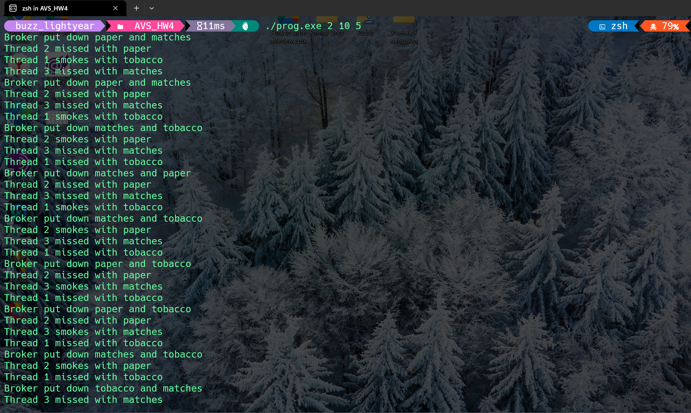
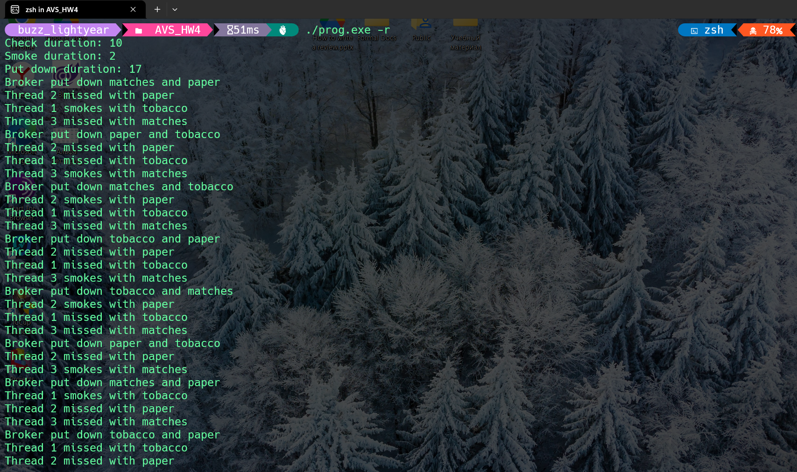

# 1. Сафаров Сардор Хайрулла угли

# 2. БПИ212

# 3. Вариант №7. Задача о курильщиках. Есть три процесса-курильщика и один процесс-посредник. Курильщик непрерывно скручивает сигареты и курит их. Чтобы скрутить сигарету, нужны табак, бумага и спички. У одного процесса-курильщика есть табак, у второго – бумага, а у третьего – спички. Посредник кладет на стол по два разных случайных компонента. Тот процесс-курильщик, у которого есть третий компонент, забирает компоненты со стола, скручивает сигарету и курит. Посредник дожидается, пока курильщик закончит, затем процесс повторяется. Создать многопоточное приложение, моделирующее поведение курильщиков и посредника. При решении задачи использовать семафоры.

# 4. Тесты, демонстрирующие проверку программ.

### Тесты находятся в папке "../in"

### Для компиляции программы
```shell
sh scripts/compile.sh
```
## Реализовано 4 варианта ввода данных:
### Для запуска программы с помощью аргументов командой строки:
```shell
sh scripts/console.sh
```
### Для запуска программы с помощью генератора случайных чисел:
```shell
sh scripts/rand.sh
```
### Для запуска программы с помощью файла:
```shell
sh scripts/file.sh
```
### Для запуска программы с помощью генератора случайных чисел и файла:
```shell
sh scripts/randAndFile.sh
```

# 5. Результаты тестовых прогонов для различных исходных данных.





# 6. Исходный код программы
```C
#include "stdio.h"
#include <stdlib.h>
#include <stdbool.h>
#include <getopt.h>
#include <time.h>
#include "unistd.h"
#include "pthread.h" // библиотека для POSIX Threads

static FILE *in, *out; // указатели на потоки ввода-вывода...
static bool randMode = false,
            fileMode = false; // флаг вывода в файл (эх...)
static char *inName = NULL,   // название этого файла
    *outName = NULL;
pthread_mutex_t mutex;       // мьютекс для блокировки
static int threadsCount = 3; // количество потоков. Код, конечно, плохой, но захардкодить константу рука не поднялась
static int itemsCount = 0;   // количество предметов на столе в текущий момент времени
static int targetItems = 6;  // контрольная сумма для предметов - сумма id потоков (1+2+3=6)
static char *items[] = {     // массив для соответствия между id потока и его компонентом
    "tobacco",
    "paper",
    "matches"};

typedef struct Smoker
{                      // структурка для передачи аргументов потокам-курильщикам
    int id;            // id потока
    int checkDuration; // время проверки стола (в секундах)
    int smokeDuration; // время курения (в секундах)
} smokerArgs;

typedef struct Broker
{                    // структурка для передачи аргументов потоку-посреднику
    int putDuration; // время добавления компонентов (в секундах)
} brokerArgs;

void *check(void *args)
{                                         // функция работы потока-курильщика
    smokerArgs *arg = (smokerArgs *)args; // получаем аргументы
    while (true)
    {                               // непрерывно работаем
        sleep(arg->checkDuration);  // ждём время для проверки стола
        pthread_mutex_lock(&mutex); // блокируем стол
        if (fileMode)
        { // для вывода в файл
            out = fopen(outName, "a");
        }
        if (itemsCount + arg->id != targetItems)
        { // если компоненты на столе нам не подходят
            fprintf(out, "Thread %d missed with %s\n", arg->id, items[arg->id - 1]);
        }
        else
        { // если не хватает именно нашего компонента
            fprintf(out, "Thread %d smokes with %s\n", arg->id, items[arg->id - 1]);
            sleep(arg->smokeDuration); // ждём время курения
            itemsCount = 0;            // компоненты использованы
        }
        if (fileMode)
        { // для вывода в файл
            fclose(out);
        }
        pthread_mutex_unlock(&mutex); // разблокируем стол
    }
    return NULL;
}

void *putDown(void *args)
{                                         // функция работы потока-посредника
    brokerArgs *arg = (brokerArgs *)args; // получаем аргументы
    while (true)
    {                                      // непрерывно работаем
        int first = rand() % threadsCount; // генерируем компоненты
        int second = (first + rand() % (threadsCount - 1) + 1) % threadsCount;
        pthread_mutex_lock(&mutex); // блокируем стол
        if (itemsCount == 0)
        {                                    // если стол пуст
            itemsCount = first + second + 2; // кладём компоненты на стол
            if (fileMode)
            { // для вывода в файл
                out = fopen(outName, "a");
            }
            fprintf(out, "Broker put down %s and %s\n", items[first], items[second]);
            sleep(arg->putDuration); // ждём
            if (fileMode)
            { // для вывода в файл
                fclose(out);
            }
        }
        pthread_mutex_unlock(&mutex); // разблокируем стол
    }
    return NULL;
}

int main(int argc, char **argv)
{
    int checkDuration, smokeDuration, putDuration; // входные данные
    pthread_t smokersThreads[threadsCount];        // потоки-курильщики
    pthread_t brokerThread;                        // поток-посредник
    size_t i;                                      // итератор
    smokerArgs args[threadsCount];                 // аргументы потоков-курильщиков
    brokerArgs args_b;                             // аргументы потока-посредника

    int opt = 0;

    while ((opt = getopt(argc, argv, "fri:o:")) != -1)
    {
        switch (opt)
        {
        case 'r':
            randMode = true;
            break;
        case 'f':
            fileMode = true;
            break;
        case 'i':
            inName = optarg;
            break;
        case 'o':
            outName = optarg;
            break;

        default:
            printf("%s", "The option is not correct!");
            break;
        }
    }

    if (randMode && fileMode)
    {
        srand(time(NULL));
        checkDuration = rand() % 20;
        smokeDuration = rand() % 20;
        putDuration = rand() % 20;
        printf("Check duration: %d\n", checkDuration);
        printf("Smoke duration: %d\n", smokeDuration);
        printf("Put down duration: %d\n", putDuration);
    }
    else if (randMode)
    {
        // ввод с помощью генератора случайных чисел
        srand(time(NULL));
        checkDuration = rand() % 20;
        smokeDuration = rand() % 20;
        putDuration = rand() % 20;
        printf("Check duration: %d\n", checkDuration);
        printf("Smoke duration: %d\n", smokeDuration);
        printf("Put down duration: %d\n", putDuration);
        out = stdout;
    }
    else if (fileMode)
    {
        // ввод из файла
        in = fopen(inName, "r");
        fscanf(in, "%d", &checkDuration);
        fscanf(in, "%d", &smokeDuration);
        fscanf(in, "%d", &putDuration);
        fclose(in);
    }
    else
    {
        // ввод из аргументов командной строки
        checkDuration = atoi(argv[1]);
        smokeDuration = atoi(argv[2]);
        putDuration = atoi(argv[3]);
        out = stdout; // вывод в консоль есть вывод в файл :)
    }

    pthread_mutex_init(&mutex, NULL);                      // инициализируем мьютекс
    args_b.putDuration = putDuration;                      // инициализируем аргументы для потока-посредника
    pthread_create(&brokerThread, NULL, putDown, &args_b); // создаём его
    for (i = 0; i < threadsCount; i++)
    {                       // для потоков-курильщиков
        args[i].id = i + 1; // инициализируем аргументы
        args[i].checkDuration = checkDuration;
        args[i].smokeDuration = smokeDuration;
        pthread_create(&smokersThreads[i], NULL, check, &args[i]); // создаём их
    }
    pthread_join(brokerThread, NULL); // чтобы программа выполнялась бесконечно (не лучший вариант реализации, но можно и так)
    pthread_mutex_destroy(&mutex);    // деактивируем мьютекс
    return 0;
}

```

# 7. Желаемая оценка 8

